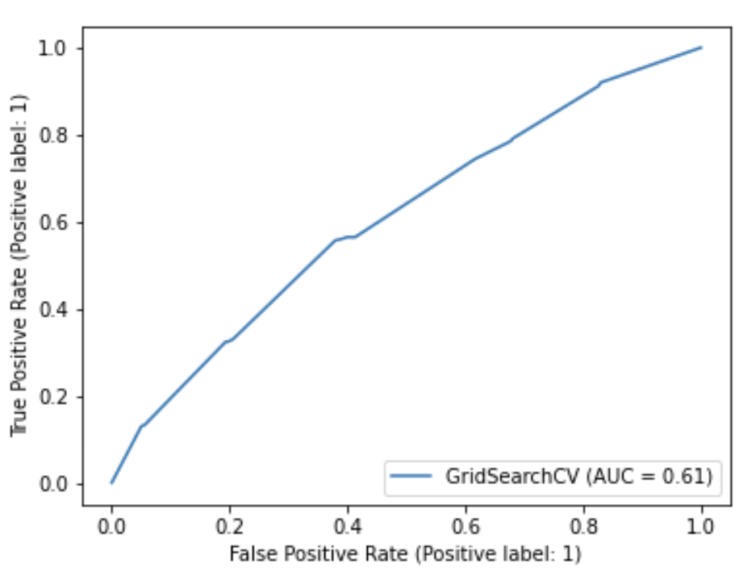
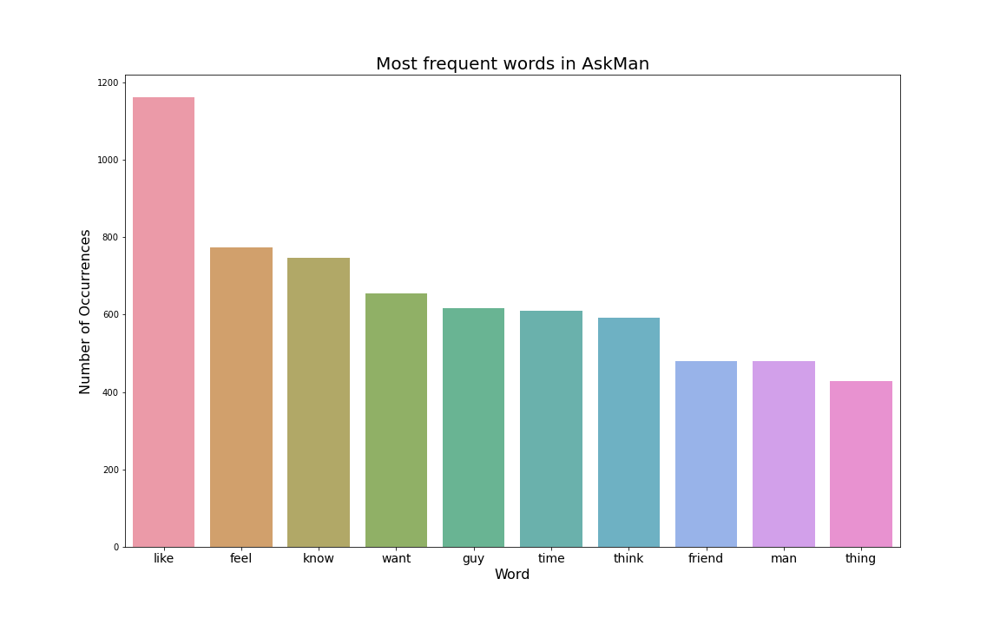
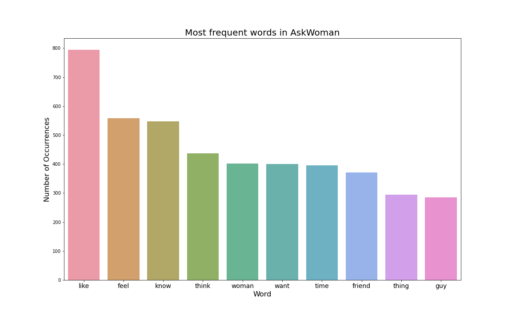

#  Project 3: Web APIs & NLP

### Problem Statement

Our marketing company is looking for a way to improve effectiveness of advertising campaignes running on Reddit. Gender targeting is common and effective method to increase conversion rates of lead generation process. Unfortunately Reddit doesn't know what its users gender. For that purpose stakeholders would like to know how accurately we can predict, if a user a woman or a man based on the subreddits they are publishing submissions to. If such difference exists, this could greatly improve targeting algorithms. As a data scientist at this company, I have been tasked to solve this issue by building a classifying models and, additionally, find most common words that are specific for adressing to each audince of each subreddit. Model should get advertisement message and confirm its suitability for woman or man audience. Project success will be evaluated using resulting f1 score (since we are interested in both classes) and accuracy score. Resulting scores should be as high as possible, but not lower than 50 percent, which is our baseline accuracy. For the purposes of this project we will make an assumption that at r/AskMan questions are asked mostly by woman and at r/AskWoman questions are asked mostly by man.

## Brief Summary of Analysis and Interpretations
For solving the stated problem, I've parsed and downloaded approx. 2000 submissions from each of two subreddits: r/AskWoman and r/AskMan, that complitely satisfies audiency requirements. After EDA and basic cleaning using RegExp, I've used SpaCy for lemmetizing, finding StopWords and cleaning auxiliary words.

I've started building models. Instead of two models, I've tried five, to be sure, that results I am getting, are not caused by incorrect classification approach. But since all chosen variety of models show similar effectiveness, we can say with confidence, that results are caused by data. 

|Model|Train Score|Test Score| F1 Score|
|:---:|:---:|:---:|:---:|  
| Baseline | 0.5039525691699605 | 0.49753208292201384 |0.5043816942551119|
| Logistic Regression | 0.6656785243741765 | 0.6307996051332675 |0.5701149425287357|
| Naive Bayes |  0.6587615283267457 | 0.5903257650542941 |0.5982575024201355|
| Decision Tree | 0.66600790513834 | 0.5972359328726555 |0.46174142480211083|
| RandomForest | 0.6831357048748353 | 0.6209279368213229 |0.5923566878980892|
|<dev>AdaBoost<dev> |<dev>0.6930171277997365<dev> | <dev>0.631786771964462<dev> |<dev>0.5932388222464559<dev>|

First few iterations of modelling gave extremely overfitted scores, for each model (>0.95 for all train scores). That could been caused by an amount of features. Tuning CountVectorizer hyperparameters has solved that problem. As a result best scores were shown by  AdaBoost model. There are still some signes of overfitting, but tuning 5 models with a a dosen hyperparameters takes a lot of time, so for the purpose of effective work, I've decided to stop on approppriate scores.
Overall we can say, that AdaBoost model shows the best results at each type of scores.

First interesting thing is that the best modeling scores were shown for variations of ngrams (1,2), that means that words order  matters for this data analysis.
Second interesting thing I've spotted is that of 4100 submissions, which consist of more than 120000 words, there are only 5964 unique words for AskMan and 5097 unique words for AskWoman.

Here is typical resulting ROC curve:
 
Datasets are pretty overlapped. ROC-AUC is within a range 0.6-0.7 for all models. Differences between classes definentely exists, but is not very significant or models are not able to catch a lot of signal among noice.

**Side test**

To get some additional data insights and reveal possible patterns I've conducted same modeling process on commentaries in those subreddits. For that purpose I've downloaded amount of comments equal to amount of submissions (~ 2000 for each /r). In the resulting dataset, baseline score was <dev>0.544444<dev>. Here are the results of the best models:

|Model|Train Score|Test Score|
|:---:|:---:|:---:|
|AdaBoost + TFIF                |0.7240566037735849 |0.6050505050505051|
|DecisionTree + TFIDF           |0.6765498652291105 |0.5797979797979798|
|Naive Bayes + CountVectorizer  |0.7134636118598383 |0.6353535353535353|

Results are practically the same, that means that commentaries section has the similar structure as the submission, with the same overlapping problem or difference exist, but models I am using are not able to spot it.

## Next steps 
Almost all models from which we are able to get features importance, used same or similar words to classify. Noticable, that almost all matched submissions contained specific and unusual words, slang etc., and mismatches are more likely to be written in formal and neutral tone. That could explain, why models could'n classify them correctly. So, my next steps would be to continue proccessing recieved data, but concidering special lexic, slang etc., and other data to confirm assumptions about men vs. women posting in each subreddit. 

## Conclusions 
As it was specified in the problem statement, model results exceeds baseline accuracy (**0.50395**) and f1 score (**0.50438**) with accuracy at **0.63178** and f1 score at **0.59323**. A ~10 percent increase at gender determining accuracy could significantly improve targeting algorythms with gender parameter. We recommend our company stakeholders using this model, however, as there is still a mistake in 40% of classifications, most optimal solution would be to implement it first on a small testing campigns, to deeply analyse economical effect. Most common words for each subreddits are:
 
  
